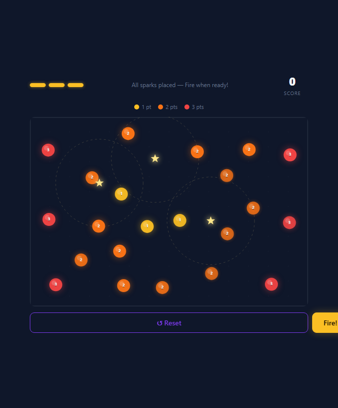

# Chain Reaction

A daily browser puzzle. Place three sparks on the board and fire — targets caught in the blast trigger their neighbours, cascading outward in waves. One attempt per day, same board for everyone.



## How to play

1. Click anywhere on the board to place a spark (gold star). Each spark shows its trigger radius as a dashed circle.
2. Drag sparks to reposition. Hit **↺ Reset** to start over.
3. Once all three sparks are placed, hit **Fire!** and watch the chain reaction unfold wave by wave.
4. Targets caught in a blast explode and trigger their own neighbours. Outer targets score more — 3 pts (red) > 2 pts (orange) > 1 pt (yellow).
5. Submit your score to the daily leaderboard and share your result.

The board is seeded daily so every player gets the same layout.

## Running locally

```bash
python -m http.server 8080
```

Then open `http://localhost:8080`. The game uses ES modules so it must be served over HTTP, not opened directly as a file.

> **Note:** The leaderboard requires Supabase credentials. Replace `YOUR_SUPABASE_URL` and `YOUR_SUPABASE_ANON_KEY` in `index.html` before deploying. See [DEPLOY.md](DEPLOY.md) for the full setup guide.

## Stack

- Vanilla JS + Canvas API — no build step, no dependencies
- [Supabase](https://supabase.com) for the daily scores table
- [Cloudflare Pages](https://pages.cloudflare.com) for hosting
